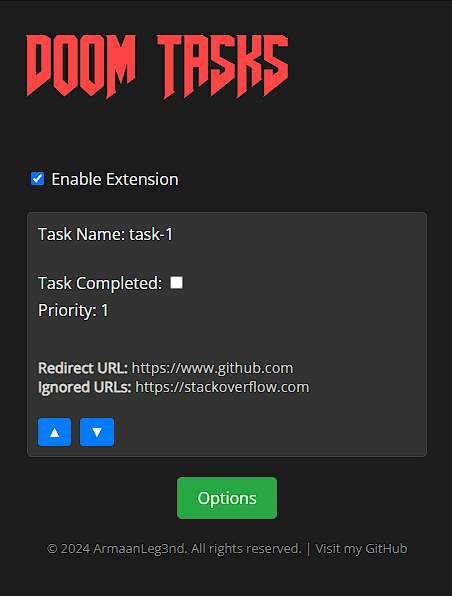
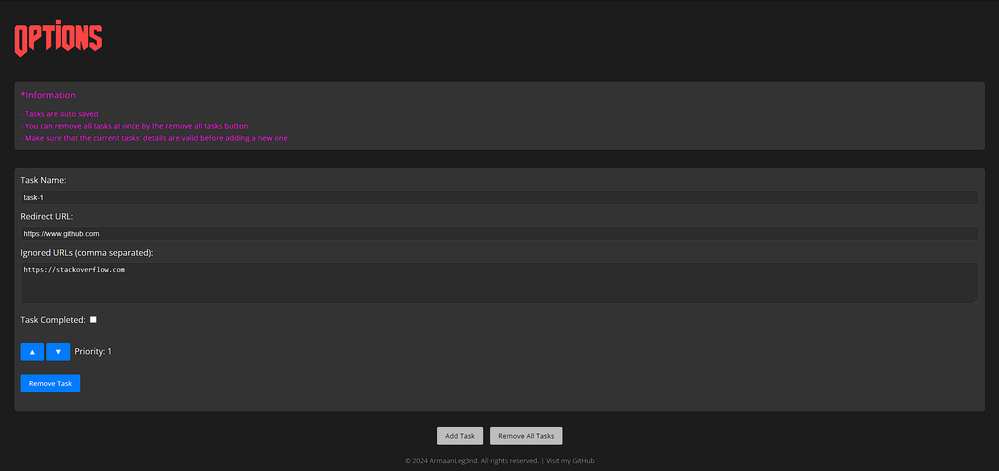

<h1 align="center">Doom Tasks</h1>

   
  <a href="">
    <picture>
      <source srcset="https://i.imgur.com/XBIE9pk.png" media="(prefers-color-scheme: dark)">
      </picture></a>
  <a href="">
    <picture>
      <source srcset="https://i.imgur.com/ZluoP7T.png" media="(prefers-color-scheme: dark)">
      </picture></a>
  <a href="">
    <picture>
      <source srcset="https://i.imgur.com/Jog9cQP.png" media="(prefers-color-scheme: dark)">
      </picture></a>
    

## Description

Doom Tasks is a browser extension which helps you staying focused by forcing you to remain on certain web pages by redirecting you to a set URL until the task is complete. The tasks can be configured along with the redirection URL and ignore URL(s) by clicking on the extension icon which will open the popup and then clicking on the options button. Priority of the tasks can also be configured in the options or the extension popup. To enable the extension, on the popup, check the enable extension check-box. To set a task as complete, click on the extension popup and check the task as complete. The extension will then start redirecting you to the next task in the list. The extension will keep redirecting you to the set URL until all the tasks are complete. The extension will also keep track of the tasks completed and the tasks remaining. The extension will ignore the other task's redirect and ignored URL(s) and won't apply redirection logic to them.

## Motivation

Getting distracted while doing work is a common problem faced by many people. Be it watching YouTube videos or browsing Reddit, time flies, as videos and pages go by and you're left with the frustrating feeling of all the unproductive hours spent.
  
The goal of this project is to improve our productivity by helping us stay focused on the task at hand by redirecting us to the set web page until the task is complete.

## Doom Tasks in Action

https://github.com/ArmaanLeg3nd/Doom-Tasks/assets/92618692/dba2d8aa-5913-40d2-9eb5-6c55b46808e3

## Screenshots

  
  

## Found a Bug?

If you believe you found a bug please file an issue in the <a href="https://github.com/ArmaanLeg3nd/Doom-Tasks/issues">issues</a> tab, with the extension version number, browser details (browser name, browser version), and steps to reproduce the bug. If you have a fix for the bug, please create a pull request with the fix and the issue number in the pull request description.

## License

Copyright (c) 2024 ArmaanLeg3nd

This software is released under the terms of the MIT License 
See the [LICENSE](LICENSE) file for further information.
